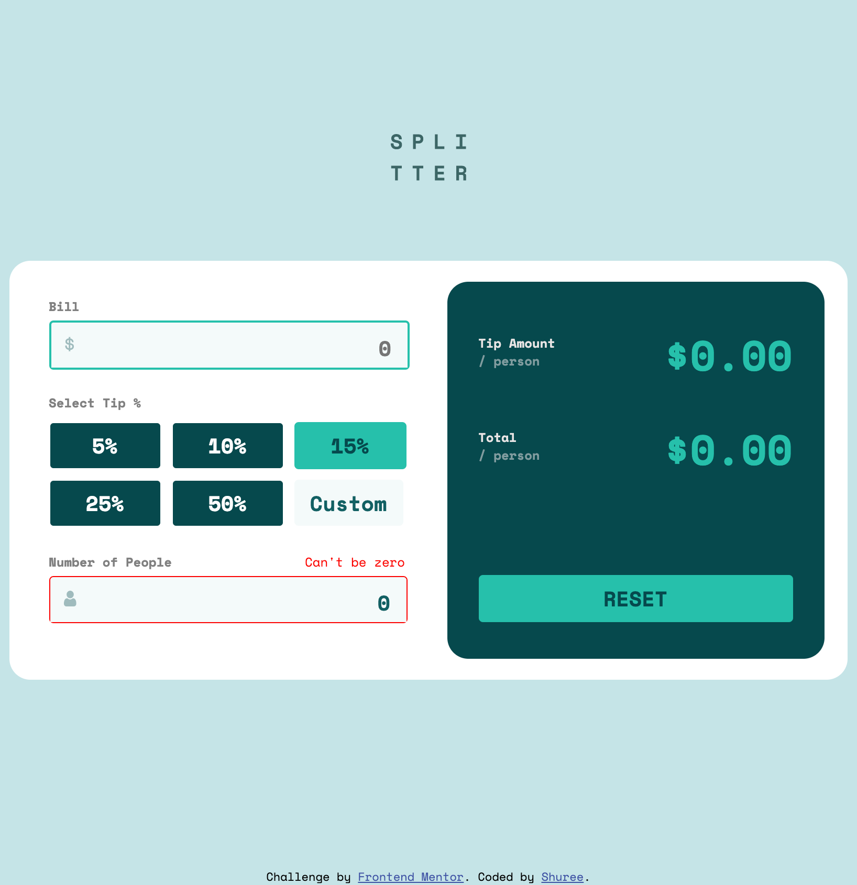
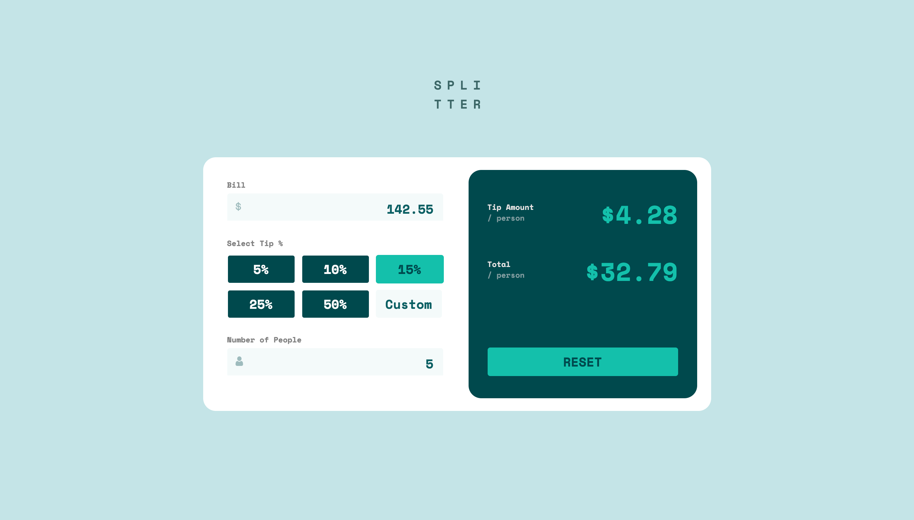
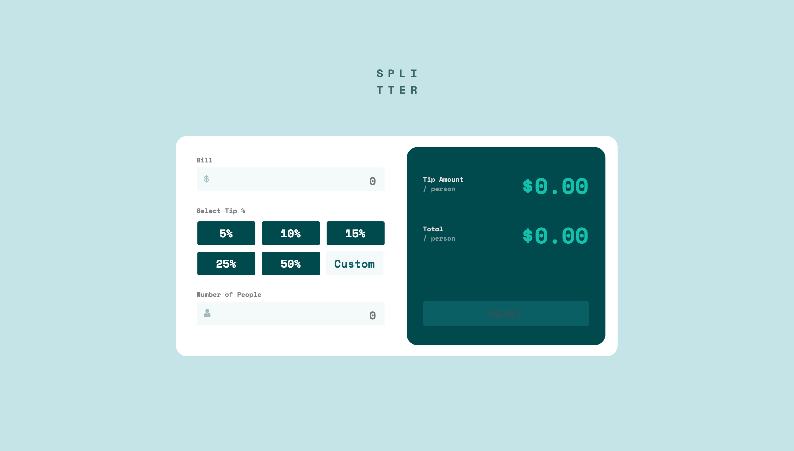
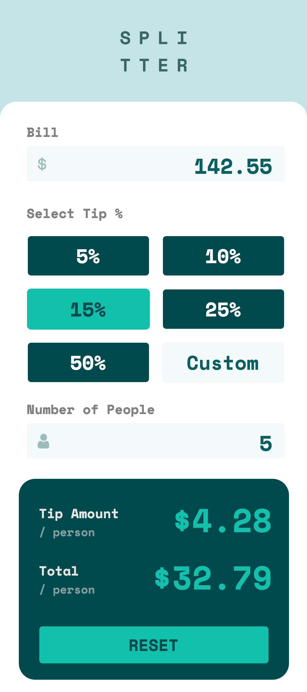

# Frontend Mentor - Tip calculator app solution

This is a solution to the [Tip calculator app challenge on Frontend Mentor](https://www.frontendmentor.io/challenges/tip-calculator-app-ugJNGbJUX). Frontend Mentor challenges help you improve your coding skills by building realistic projects.

## Table of contents

- [Overview](#overview)
  - [The challenge](#the-challenge)
  - [Screenshot](#screenshot)
  - [Links](#links)
- [My process](#my-process)
  - [Built with](#built-with)
  - [What I learned](#what-i-learned)
  - [Continued development](#continued-development)
  - [Useful resources](#useful-resources)
- [Author](#author)
- [Acknowledgments](#acknowledgments)


## Overview

### The challenge

Users should be able to:

- View the optimal layout for the app depending on their device's screen size
- See hover states for all interactive elements on the page
- Calculate the correct tip and total cost of the bill per person

### Screenshot

- Active State ScreenShot 
  
- Completed Design ScreenShot 
  
- Desktop Design Screenshot 
  
- Mobile Design  
  

### Links

- Solution URL: [GitHub](https://github.com/shuree0331/tip-calculator-app-main)
- Live Site URL: [Netlify](https://zen-jennings-e655e3.netlify.app/)

## My process

### Built with

- Semantic HTML5 markup
- CSS custom properties
- Flexbox
- CSS Grid
- Mobile-first workflow
- JavaScript Reference

### What I learned

After completing this challenge, I have learned more semantic CSS style and semantic HTML5 markup to make it more readable and more accessable. Also, improved skill of debugging on Chrome DevTools and using console.log technique. 

To see how you can add code snippets, see below:

```html
<input onchange="checkPeople()" class="people-number" id="people-number" placeholder=0 onfocus="this.placeholder=''" required/>
```
```css
.tip-button {
    display: grid;
    grid-template-columns: auto auto auto;
    grid-template-rows: auto auto;
    column-gap: 10px;
    row-gap: 10px; 
    margin-top: 10px;
}
```
```js
custom.addEventListener('change', (cus) => {
    percent.forEach(element => {
        element.classList.remove('percent-active')
    } )
    tipPercent = +cus.target.value.replace("%", "") / 100

    update()
})
```

### Continued development

I found it is bit hard to find the right name for class and id on semantic HTML markup and CSS style. As well as, need to expand the knowledge of JS basic tool like elements, properties and libraries. 


### Useful resources

- [MDN Web Docs mozilla](https://developer.mozilla.org/) - This helped me to write correct syntax of elements. And it is useful for understanding each element references.
- [Stack Overflow](https://stackoverflow.com/questions/) - This is an amazing website that has wide range of questions and answers community between professionals and beginners. 

## Author

- Frontend Mentor - [@Shuree](https://www.frontendmentor.io/profile/shuree0331)
- Twitter - [@Shurentuya](https://www.twitter.com/Shurentuya)


## Acknowledgments

Thank you FrontEnd Mentor for such a great job for helping others to challenge themselves with real life projects :)
